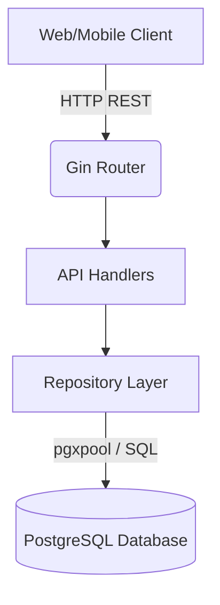
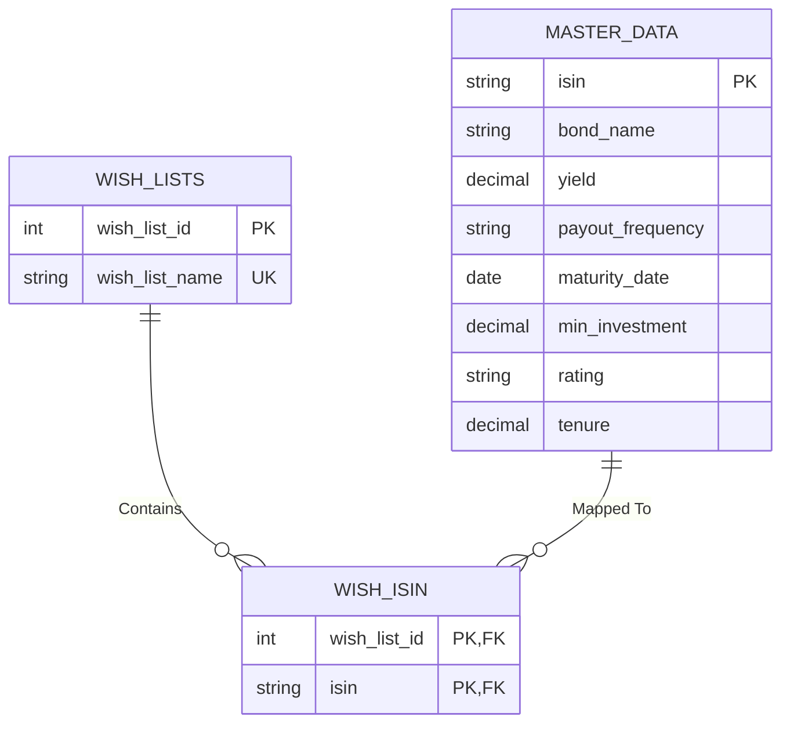

# High-Level Design (HLD): TapInvest Wishlist API

## 1. Introduction
The TapInvest Wishlist API is a backend service designed to manage user wishlists for financial bonds. It enforces strict business rules regarding list creation and bond limits while ensuring data consistency through a normalized PostgreSQL database.

## 2. System Architecture overview
The application follows a standard **3-Tier layered architecture**:
- **Presentation Layer (Handlers/Controllers)**: Receives HTTP requests, validates initial parameters/payloads, and routes them to the appropriate services/repositories.
- **Data Access Layer (Repositories)**: Executes raw SQL queries and maps database rows to Go domain models. Houses all core database-level business logic.
- **Storage Layer (Database)**: A PostgreSQL relational database enforcing referential integrity and cascading deletions.

## 3. Technology Stack
* **Language**: Go 1.20+
* **Web Framework**: Gin (`gin-gonic/gin`) - Chosen for high performance and excellent routing capabilities.
* **Database Driver**: `pgx` (`jackc/pgx/v5/pgxpool`) - Chosen for robust connection pooling and native PostgreSQL feature support.
* **Database**: PostgreSQL - Relational storage ensuring ACID compliance.
* **Configuration**: `godotenv` for `.env` management.
* **Testing**: Standard Go `testing` library, `httptest` for handlers, and `testify` for assertions.

## 4. Database Schema Design
The system uses three core tables linked via foreign keys. Business rules like cascading deletions are handled natively by the database engine.

### Business Rules Enforced at Database Layer
1. **Name Uniqueness**: Enforced by a `UNIQUE NOT NULL` constraint on `wish_lists.wish_list_name`.
2. **Cascade Deletion**: Handled by `ON DELETE CASCADE` inside `wish_isin`. When a wishlist is deleted, all bonds mapped to it are instantly removed.

## 5. API Design & Endpoints
The REST API endpoints follow standard resource-oriented conventions and return standard JSON wrapper responses.

| Method | Endpoint | Description |
| :--- | :--- | :--- |
| **GET** | `/api/health` | Service health check |
| **GET** | `/api/bonds` | Retrieve all bonds from `master_data` |
| **POST** | `/api/wishlists` | Create a new wishlist (Limit: Max 5 overall) |
| **GET** | `/api/wishlists` | Retrieve all wishlists + bond counts |
| **GET** | `/api/wishlists/:id` | Retrieve wishlist details + all mapped bonds |
| **PUT** | `/api/wishlists/:id` | Rename wishlist (Enforces <=25 chars & uniqueness) |
| **DELETE** | `/api/wishlists/:id` | Delete wishlist and cascade delete bonds |
| **POST** | `/api/wishlists/:id/items` | Add a bond to wishlist (Limit: Max 10 bonds, No duplicates) |
| **DELETE** | `/api/wishlists/:id/items/:isin` | Remove a bond from a wishlist |

## 6. Business Logic Validation flow
Instead of a heavy intermediary service layer, this MVP utilizes "Thin Handlers" and "Smart Repositories".
- **Handler Level**: Enforces format (JSON parsing) and structural bounds (Name is not empty, Name <= 25 characters via `utils/validation.go`).
- **Repository Level**: Enforces count bounds (Max 5 wishlists total via `COUNT(*)`, Max 10 bonds per wishlist via `COUNT(*)`) prior to executing `INSERT` statements. 

## 7. Error Handling Strategy
A centralized `utils.ErrorResponse` is used. Standardized HTTP codes map to database conditions:
* `400 Bad Request`: Validation failure, duplicate bond, max lists reached, max bonds reached.
* `404 Not Found`: Referencing a wishlist ID or ISIN that doesn't exist.
* `500 Internal Server Error`: Database connection failures.

## 8. Scalability & Future Considerations
- **Pagination & Search**: The `master_data` fetching should be augmented with `LIMIT`, `OFFSET`, and `ILIKE` clauses as the dataset grows.
- **Authentication/Authorization**: A multi-user system would require adding a `user_id` column to `wish_lists` and checking a JWT token at the API Gateway or Gin middleware layer.
- **Caching**: Frequently accessed bonds (`master_data`) could be cached via Redis to reduce DB load.
